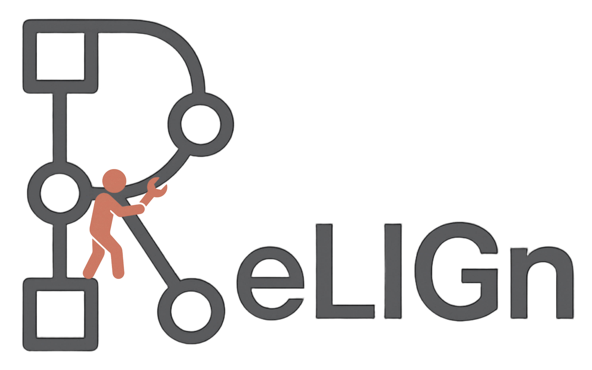

# ReLIGn-tool
<p align="center">
  
</p>


This project provides a tool for process Model Repairing supported by Local Instance Graphs, following the approach described in the article [*Model repair supported by frequent anomalous local instance graphs*](https://www.google.com/search?client=safari&rls=en&q=model+repair+supported+by&ie=UTF-8&oe=UTF-8).
A demonstration of the tool is available at this [link](https://youtu.be/cg-GX0eXVbo) 


### Requirements
To run our application you need to have installed:
* [Python 3.9.6](https://www.python.org/downloads/release/python-396/)
  
* [Java 8](https://www.oracle.com/it/java/technologies/javase/javase8-archive-downloads.html)

* [MySQL](https://dev.mysql.com/downloads/file/?id=537130)
  
* A set of packages that you can configure inside an environment by using the [requirements.txt](https://github.com/KDMG/ReLIGn-tool/edit/main/requirements.txt) file

* *Optional*: Note that the tool has been tested on MacOS X, therefore, if you are working on another operating system, you may need to recompile the files located in the [`subdue_files`](https://github.com/KDMG/ReLIGn-tool/tree/main/subdue_files) directory by following the instructions at this [link](https://github.com/gromgull/subdue/tree/master).


### Reproduce results
To run our program copy and paste the following command in your terminal:
```
https://github.com/KDMG/ReLIGn-tool/
cd ReLIGn-tool

python repair_gui.py
```
In the [`data`](https://github.com/KDMG/ReLIGn-tool/data) folder you can find some data to test the tool.

### Contributors
| Contributor name | Contacts |
| :-------- | :------- | 
| `Claudia Diamantini`     | c.diamantini@univpm.it | 
| `Laura Genga`            | l.genga@tue.nl         | 
| `Gobbi Chiara`           | c.gobbi@pm.univpm.it   | 
| `Alessandro Mele`        | a.mele@pm.univpm.it    | 
| `Domenico Potena`        | d.potena@pm.univpm.it  | 
